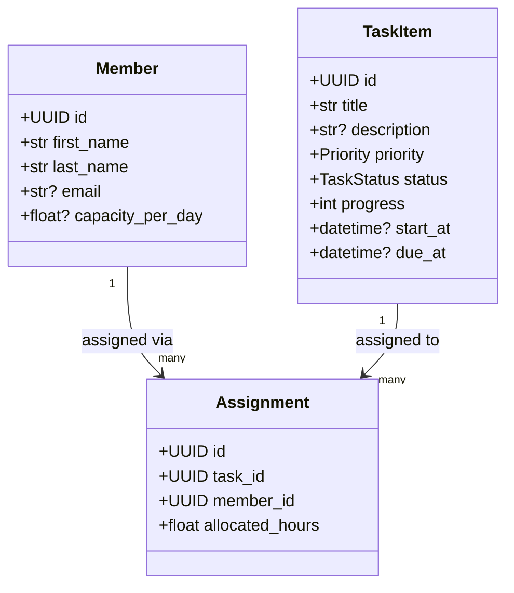

# Task Planner (Python) — Курсова робота

**Мова:** Python 3.10+ · **Шари:** DAL / BLL / PL · **Збереження:** JSON-файли · **Тести:** pytest · **IoC:** простий контейнер

## Як запустити
```bash
python -m venv .venv && source .venv/bin/activate   # Windows: .venv\Scripts\activate
pip install -e .
task-planner --help
```

## Приклади команд
```bash
task-planner member add "Іван" "Петренко" --email ivan@example.com --capacity 6
task-planner task add "Підготувати діаграму" --prio High --due 2025-11-25
task-planner task list --status Overdue
task-planner task assign <task_id> <member_id> --hours 3
task-planner task set-status <task_id> Done
task-planner report state
```

## Архітектурна діаграма (Mermaid)


## Структура
```
src/task_planner/
  bll/  # бізнес-логіка
  dal/  # доступ до даних
  pl/   # CLI (Typer)
  ioc.py
data/
tests/
```
